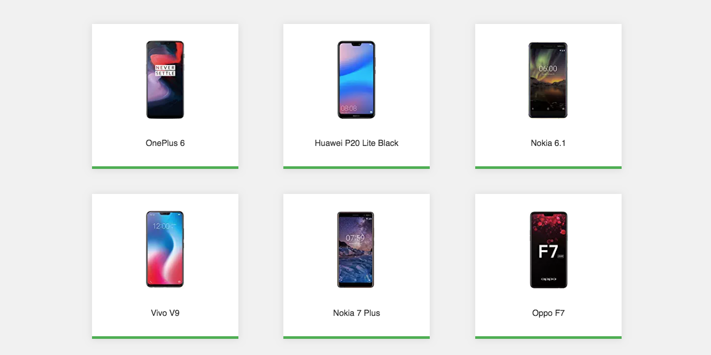
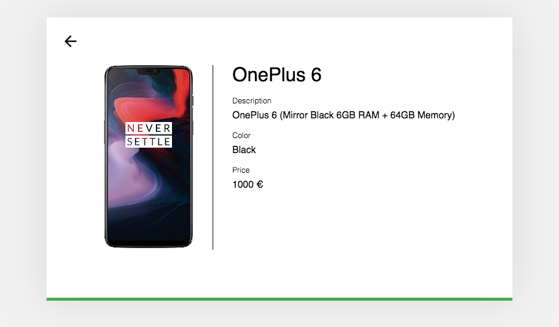

## Phone Catalog App

Application that shows a list with the latest models of mobile phones and some of their features such as name, price, color, etc..




---
## Warning: All code, environment variables and docker commands have been tested and proven on a MacOS system. I understand that under a Windows system it will change something.
## Make sure you have all the necessary ones installed: node.js, environment variables, docker, docker-compose, etc.
---

## The application consists of a client and a server

### Steps to run the Server locally:

```javascript
export API_HOST=localhost
export API_PORT=3000
```

```javascript
yarn build && yarn start
```
or

```javascript
npm build && npm start
```

### Steps to run the Client locally:

```javascript
export PORT=8080
````

```javascript
yarn build && yarn start
```
or

```javascript
npm build && npm start
```

## You can also start the Client and Server with Docker:

- Client
```javascript
docker build -t code-challenge-paradigma-client:dev .

docker run -d --name code-challenge-paradigma-client -p 8080:8080 code-challenge-paradigma-client:dev
```

- Server

```javascript
docker build -t code-challenge-paradigma-server:dev .

docker run -d --name code-challenge-paradigma-server -p 3000:3000 code-challenge-paradigma-server:dev
````

## If you don't want to do all the above steps, the magic happens with Docker Compose. Just run this command on your local terminal:

```javascript
docker-compose up
```

---

## Technologies used to make the application:

Client:
- React.js
- Redux
- Redux-Saga
- React Router
- HTML5
- CSS3
- Animate.css

Server:
- Node.js
- Express.js
- axios

Testing
- Jest (client)
- Enzyme (client)
- Mocha (server)
- Sinon (server)
- Chai (Server)

Containers:
- Docker
- Docker Compose
